# はじめに

コンテナオーケストレーターを選ぶとき、必ず出てくるのが「ECS か Kubernetes か」という問い。
ネット上には「K8s は難しい」「ECS は AWS ロックイン」といった断片的な話が溢れていますが、本質を一言でまとめるとこうです。

> **ECS は「AWS が運用の大半を隠してくれる薄いスケジューラ」、Kubernetes は「自分で組み立てる分散システムのフレームワーク」。**

この設計思想の違いが、技術・ユースケース・障害耐性・運用・セキュリティのすべての差に効いてきます。

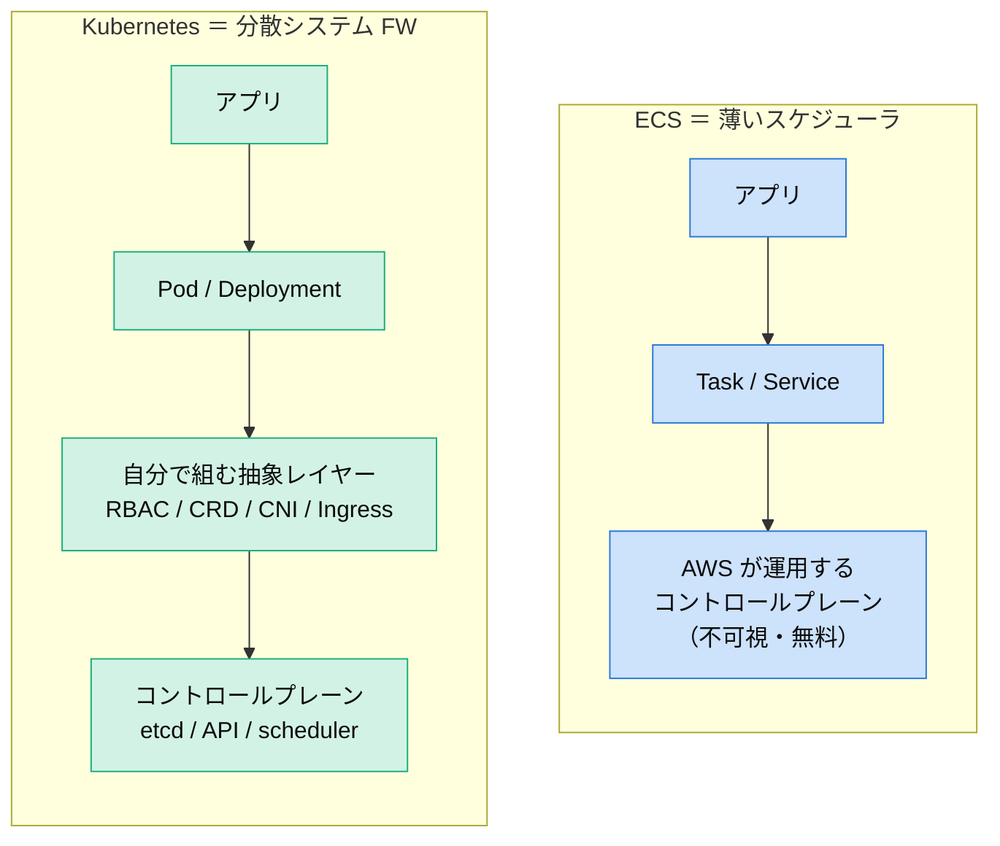

:::note info
筆者はクラウドセキュリティ（CSPM / CNAPP）が専門なので、最後に**セキュリティ運用の観点**も一節足しています。
:::

---

# TL;DR（結論だけ先に）

- **迷ったら ECS（Fargate）**。AWS 限定・小〜中規模・運用リソースが少ないなら、これで大半の要件は満たせる。
- **Kubernetes を選ぶべき**なのは、①マルチクラウド/オンプレ要件がある ②大規模・多チームで統制が要る ③Operator/CRD でプラットフォームを内製したい、のいずれか。
- 耐障害性は **K8s が上限（設計自由度）が高く、ECS が下限（デフォルトの堅牢さ）が高い**。
- 運用は **ECS ＝ AWS にアウトソース / K8s ＝ 自組織に内製**。専任チームを持てない組織が K8s を選ぶと、アップグレードと運用維持で疲弊する。

---

# 1. 技術的アーキテクチャの違い

まず全体像。両者とも「コントロールプレーン（頭脳）」と「データプレーン（コンテナが実際に動く場所）」に分かれます。違いは**どこまで自分で持つか**です。

## ECS のアーキテクチャ

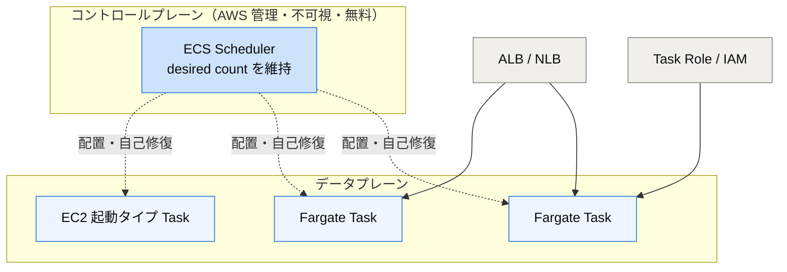

コントロールプレーンは AWS が持っていて**見えないし課金もされない**。ユーザーは Task を定義して「3つ動かして」と言うだけ。

## Kubernetes のアーキテクチャ

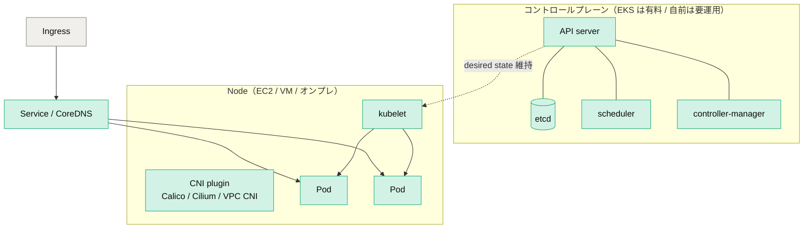

コントロールプレーンの構成要素が全部露出していて、**etcd のバックアップや証明書ローテ、CNI の選定まで自分の責任範囲**に入ってきます（EKS なら AWS が肩代わり）。

## 主要スペックの対比

| 観点 | ECS | Kubernetes |
|---|---|---|
| コントロールプレーン | AWS 管理・不可視・**無料** | etcd + API server + scheduler 等。EKS は有料（$0.10/h/クラスタ）、自前は全部運用 |
| 最小デプロイ単位 | Task | Pod |
| 抽象の階層 | Task Definition → Service（浅い） | Pod → ReplicaSet → Deployment（多層） |
| 構成管理 | JSON の Task Definition | YAML + 調整ループ（reconciliation loop）が中核 |
| データプレーン | EC2 起動タイプ / **Fargate** | ノード（EC2/VM/オンプレ）、EKS Fargate も一部 |
| ネットワーク | awsvpc で Task に ENI 直付け | CNI プラグインを選定・運用 |
| サービスディスカバリ | Cloud Map / ALB | 組み込み Service + CoreDNS + Ingress |
| 秘匿情報 | SSM / Secrets Manager | ConfigMap / Secret（+ External Secrets） |

## 抽象の階層 ― ここが「覚えることの多さ」の正体

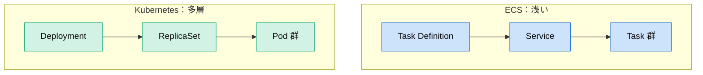

## 同じ「nginx を 3 つ動かす」を書き比べる

**ECS（Task Definition 抜粋 + `desiredCount: 3` の Service）**

```json
{
  "family": "web",
  "networkMode": "awsvpc",
  "requiresCompatibilities": ["FARGATE"],
  "cpu": "256",
  "memory": "512",
  "containerDefinitions": [
    { "name": "nginx", "image": "nginx:1.27", "portMappings": [{ "containerPort": 80 }] }
  ]
}
```

**Kubernetes（Deployment + Service）**

```yaml
apiVersion: apps/v1
kind: Deployment
metadata:
  name: web
spec:
  replicas: 3
  selector:
    matchLabels: { app: web }
  template:
    metadata:
      labels: { app: web }
    spec:
      containers:
        - name: nginx
          image: nginx:1.27
          ports:
            - containerPort: 80
---
apiVersion: v1
kind: Service
metadata:
  name: web
spec:
  selector: { app: web }
  ports:
    - port: 80
```

やることは同じでも、K8s は概念（Deployment / Service / selector / label）が多い。この差が学習コストに直結します。

---

# 2. ユースケース適性

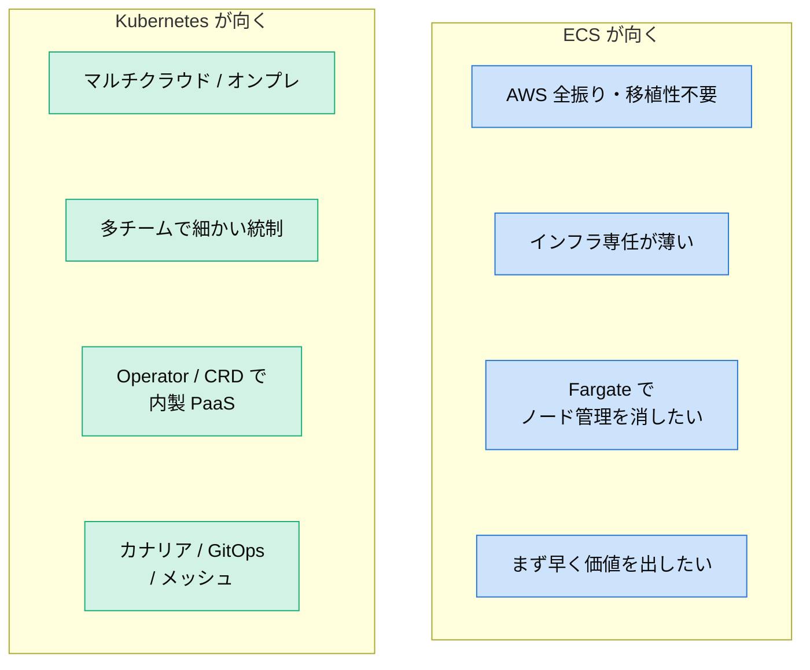

判断軸を絞るなら「**AWS だけで完結するか**」と「**プラットフォームを作る側に回るか、使うだけか**」の 2 つです。

---

# 3. 障害耐性・可用性

## 自己修復は「思想が同じ」

両者とも「宣言した数を維持する」調整ループを回します。ここは考え方が一緒。

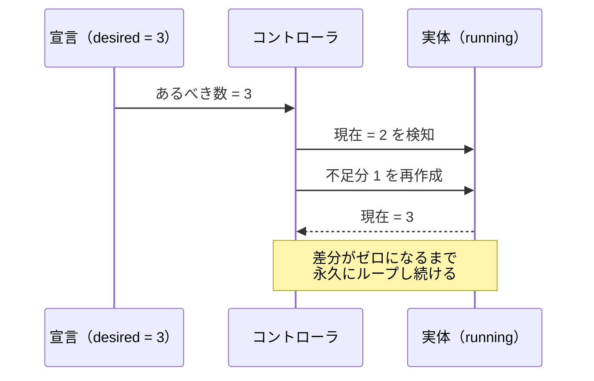

## マルチ AZ での分散

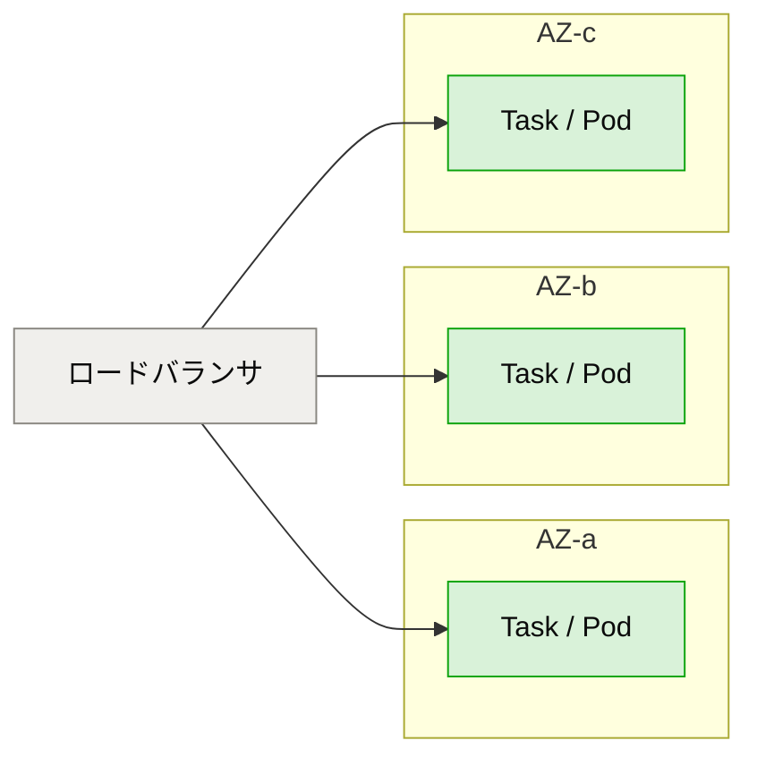

- ECS はプレースメント戦略（spread / binpack）で AZ 分散。
- K8s は `topologySpreadConstraints` / PodAntiAffinity で**より細かく**制御可能。

## 決定的な差 ― コントロールプレーン障害

| | ECS | Kubernetes |
|---|---|---|
| コントロールプレーン障害 | AWS が冗長化・SLA 提供。**ユーザーは何もしない** | セルフマネージドだと **etcd クォーラム・バックアップ・証明書ローテ**が生命線（EKS なら AWS 肩代わり） |
| ヘルスチェック | ALB / コンテナヘルスチェック | liveness / readiness / startup probe（粒度が細かい） |
| 障害の切り分け | 層が薄く速い | 層が多く（Pod→Node→CNI→etcd→API）調査が複雑 |

> **まとめ**：作り込めば K8s の方が高い可用性を設計できる。だが「何もしなくても壊れにくい」のは ECS（特に Fargate）。
> **耐障害性は K8s が上限が高く、ECS が下限が高い。**

---

# 4. エコシステム

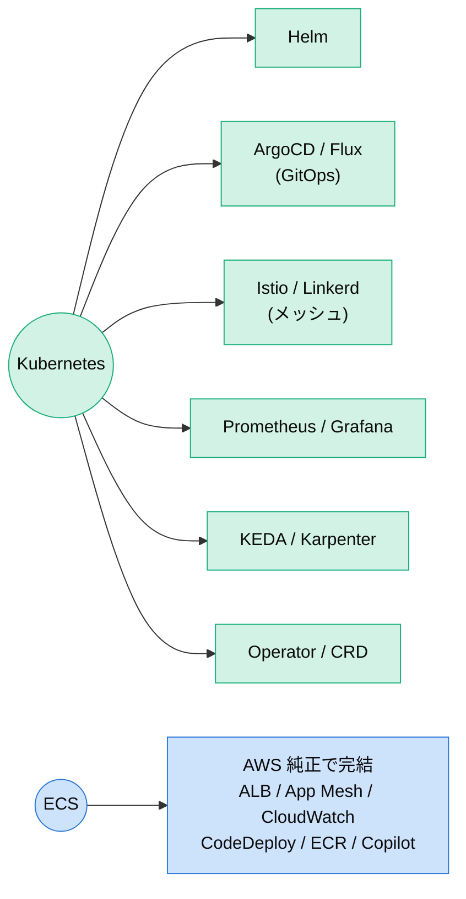

- **Kubernetes**：CNCF 中心に圧倒的。求人・知見・OSS の母数が桁違いで、CRD による無限拡張が効く。スキルはどのクラウドでも通用する。
- **ECS**：基本は AWS 純正。サードパーティは少ないが「AWS の中では全部つながっていて摩擦がない」。覚える概念が少なく、スキルは AWS 特化。

---

# 5. 運用（Operations）― 実務で一番効く差

## アップグレードのモデルが根本的に違う

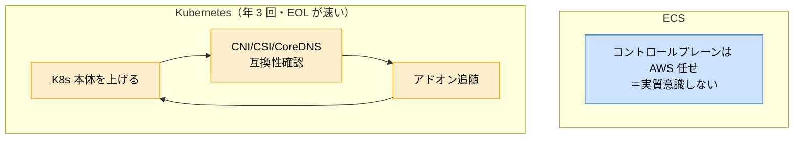

K8s は本体 + アドオン（CNI/CSI/CoreDNS）の互換性を追い続ける“アップグレード地獄”が**運用の定常コスト**になります。

## 運用観点まとめ

| 運用観点 | ECS | Kubernetes |
|---|---|---|
| 学習コスト | 低い（数日で本番イメージ） | 高い（習熟に数ヶ月） |
| アップグレード | AWS 任せで実質意識しない | 年 3 回・EOL 速い。本体+アドオンの互換性追随 |
| オートスケール | Service Auto Scaling + Capacity Provider（Fargate は自動） | HPA/VPA + Cluster Autoscaler/Karpenter |
| 可観測性 | CloudWatch にほぼ統合（Container Insights） | Prometheus/Grafana/OTel を自前構築 |
| コスト | コントロールプレーン無料。Fargate は割高だが工数ゼロ | EKS クラスタ課金 + ノード + アドオン運用。**TCO は人件費が支配的** |
| 運用自動化の思想 | AWS が良きに計らう（カスタマイズ余地小） | GitOps + Operator で「運用をコード化」（上限が高い） |

> **運用の本質的トレードオフ**
> ECS は**運用作業を AWS にアウトソース**するモデル。楽だが AWS の設計思想の外には出られない。
> Kubernetes は**運用能力を自組織に内製**するモデル。専任チームを持てる規模なら強力だが、体制がないと維持コストで疲弊する。

---

# 6. Fargate on ECS vs Fargate on EKS

「Fargate ＝ ノード管理が消えるサーバーレス」という点は同じですが、**ECS に載せるか EKS に載せるかで別物**です。ここを混同すると設計を誤ります。

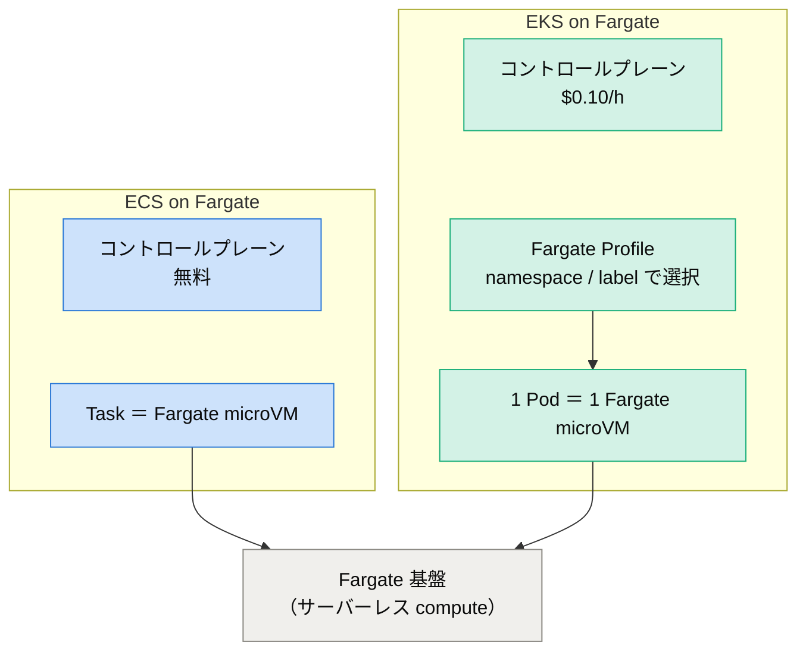

## 何が同じで、何が違うか

**同じ**：ノード（EC2）の管理・パッチ・スケールが不要。Task/Pod ごとに独立した microVM で隔離され、使ったぶんだけ課金。

**違う**：EKS on Fargate は「Kubernetes の API と豊富なエコシステムを保ったまま、ノードだけ消す」構成。そのぶん **K8s 特有の制約**を Fargate 側が肩代わりできず、いくつかの機能が使えません。

| 観点 | ECS on Fargate | EKS on Fargate |
|---|---|---|
| コントロールプレーン料金 | **無料** | $0.10/h/クラスタ |
| デプロイ単位 | Task（複数コンテナ可） | Pod（**1 Pod = 1 microVM**） |
| 配置指定 | 起動タイプ指定だけ | **Fargate Profile**（namespace / label で対象を選択）が必須 |
| DaemonSet | 概念なし（不要） | **非対応**。ノードが無いため node-level agent が動かせない |
| 特権コンテナ / hostPath | 不可 | **不可** |
| GPU | 不可 | 不可 |
| 永続ボリューム | EFS | **EFS のみ**（EBS 不可） |
| 起動速度 | 速い | やや遅い（Pod ごとに microVM 起動） |
| エコシステム | AWS 純正 | **Helm / CRD / Operator など K8s 資産をそのまま利用** |
| 学習コスト | 最小 | K8s の知識は必要（ノード運用だけが消える） |

## セキュリティ・可観測性での大きな落とし穴（CNAPP 視点）

EKS on Fargate で最も効くのが **DaemonSet 非対応**です。Kubernetes ではセキュリティ/可観測性エージェント（Falco/Sysdig、各種 CNAPP のランタイムセンサー、ログ収集の Fluent Bit など）を **DaemonSet で全ノードに 1 つ配る**のが定石ですが、Fargate にはノードが無いため**この方式が使えません**。

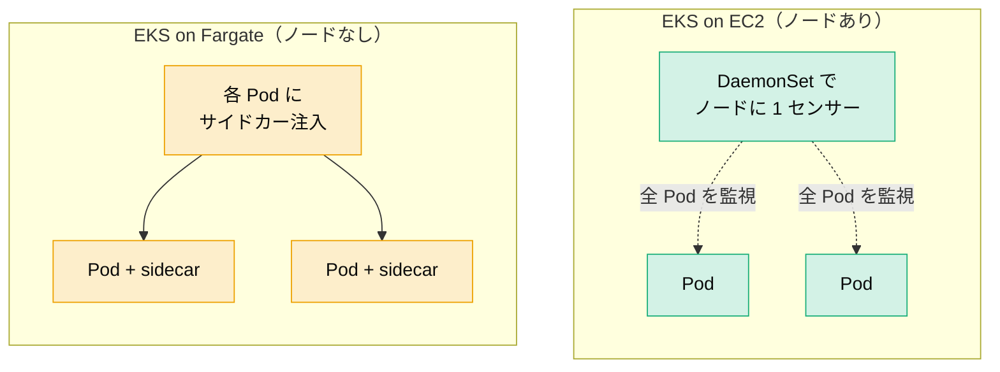

そのため Fargate では **サイドカー方式**（各 Pod にセンサーを注入）や、Fargate 対応のフックに頼ることになり、カバレッジ設計と運用が変わります。ランタイム保護を前提にするなら、この制約は選定段階で必ず織り込むべきポイントです。

## 使い分け

- **ECS on Fargate** … AWS 完結・最小構成でサーバーレスにしたい。コントロールプレーン無料で最も安く速い。
- **EKS on Fargate** … K8s API とエコシステムは維持しつつ、特定ワークロード（例：バースト的なジョブ、テナント隔離したい Pod）だけノード管理を消したい。全部を Fargate にするより、**EC2 ノード + Fargate Profile のハイブリッド**で「隔離したい namespace だけ Fargate」という使い方が実務では多い。

---

# 7. セキュリティ運用の観点（CNAPP 視点の補足）

ここは筆者の専門なので少し踏み込みます。ポイントは**守るべき層の数＝攻撃面の広さ**です。

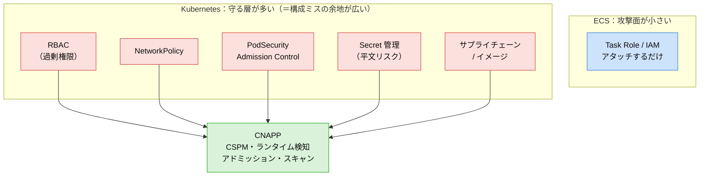

- **ECS**：Task Role で IAM をアタッチするだけとシンプル。抽象が薄いぶん攻撃面が小さく、ガードレールの多くが AWS 側にある。
- **Kubernetes**：RBAC・NetworkPolicy・PodSecurity・Admission・Secret・サプライチェーンと守る層が多い。裏を返すと構成ミスの余地が広く（過剰権限 RBAC、公開 API server、特権 Pod、Secret 平文、CNI 設定不備…）、**CSPM + ランタイム検知 + アドミッション制御 + イメージスキャンを束ねた CNAPP の投資対効果が ECS より明確に高い**。IAM 連携は IRSA / EKS Pod Identity で行います。

一言でいうと、**ECS は守る対象がシンプル、K8s は守る対象が多いぶんセキュリティ製品の価値が出る**。

---

# 8. 選定フローチャート

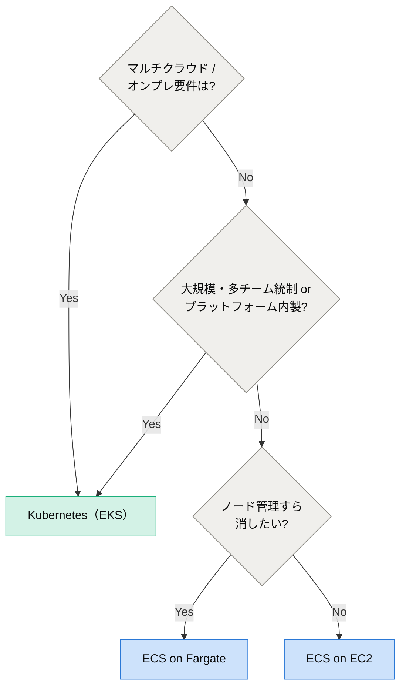

---

# まとめ

| | ECS | Kubernetes |
|---|---|---|
| 思想 | 運用を AWS にアウトソース | 運用を自組織に内製 |
| 強み | シンプル・低学習コスト・低運用負荷 | 移植性・拡張性・エコシステム・統制 |
| 弱み | AWS ロックイン・拡張性の上限 | 高い学習/運用コスト |
| 耐障害性 | デフォルトが堅牢（下限が高い） | 作り込めば最強（上限が高い） |
| セキュリティ | 攻撃面が小さい | 守る層が多く CNAPP の価値が高い |
| 向く組織 | 小〜中規模・AWS 特化 | 大規模・マルチクラウド・専任チームあり |

**「過剰な複雑性を買わない」のが正解**です。K8s は強力ですが、それを使いこなす体制がないなら ECS(Fargate) で十分なケースが大半。逆に、移植性やプラットフォーム内製が戦略なら K8s 一択です。

---

*この記事が役に立ったら LGTM & ストックしていただけると励みになります🙌*
